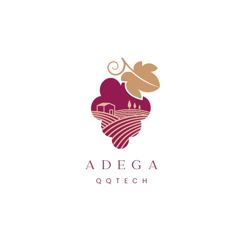
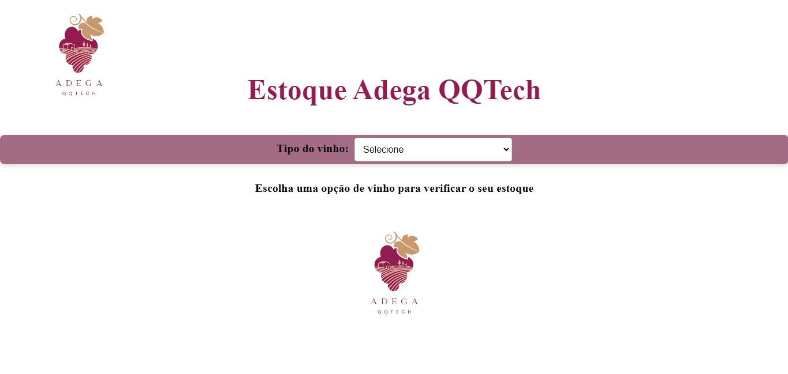
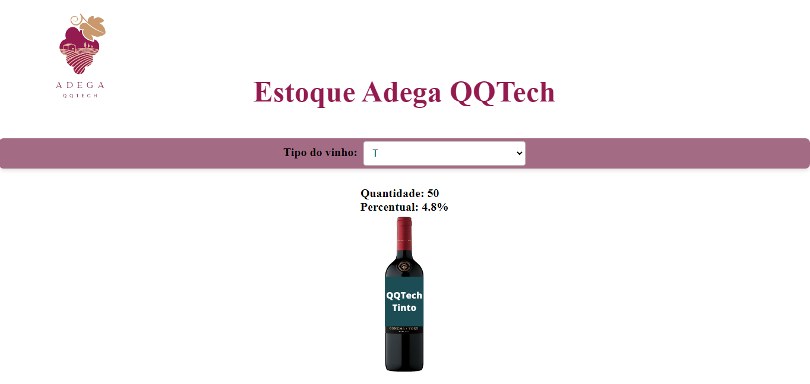
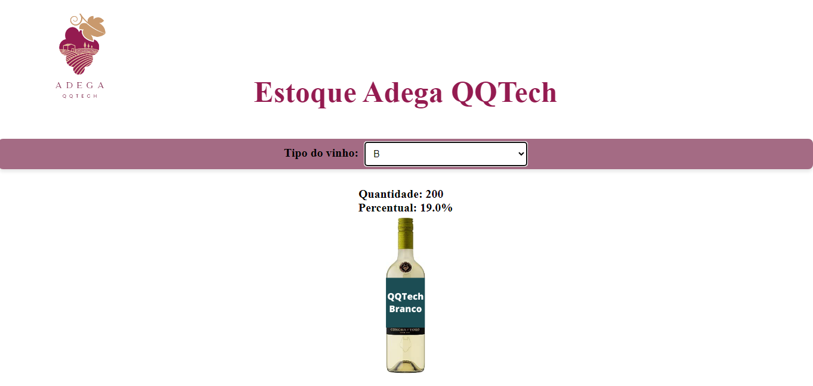
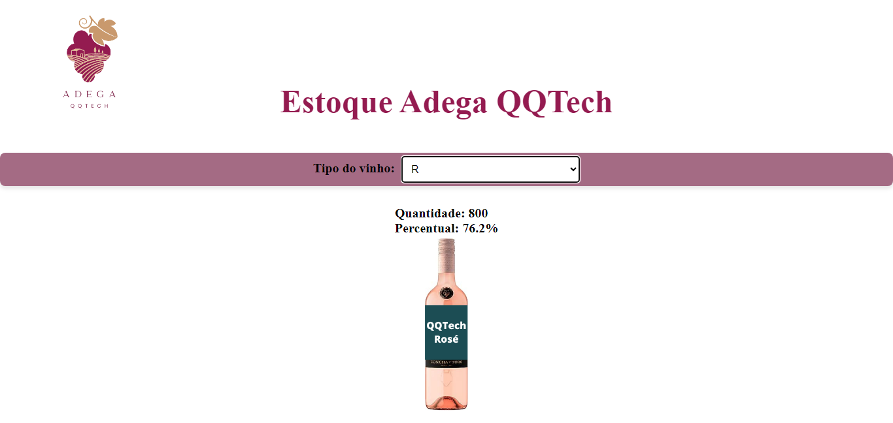
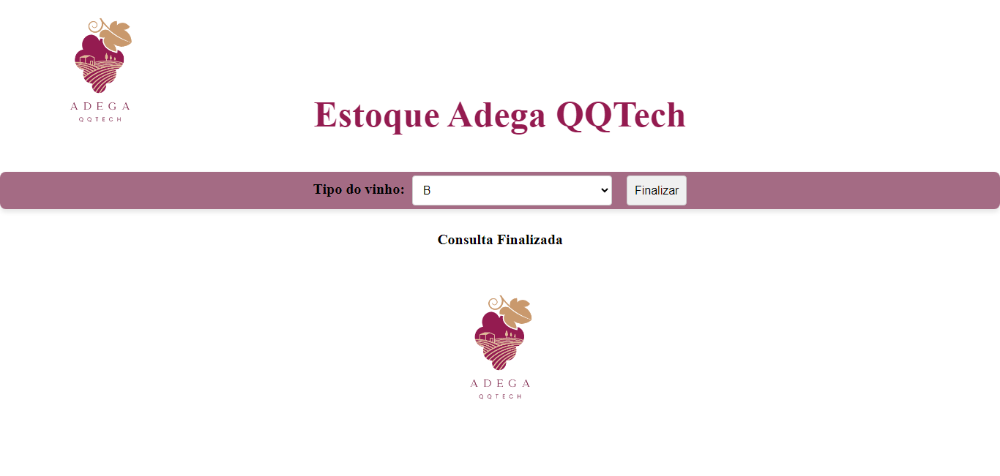

## TAREFA

<p style="text-align:justify">Construa uma solução que permita fazer um levantamento do estoque de vinhos de uma adega, tendo como dados de entrada tipos de vinho, sendo: 'T' para tinto, 'B' para branco e 'R' para rose. Especifique a porcentagem de cada tipo sobre o total geral de vinhos; a quantidade de vinhos é desconhecida, utilize como finalizador 'F' de fim.</p>

## SOLUÇÃO

<p align="center">

</p>

## ARQUITETURA

```
📁ESTOQUE-ADEGA
|
|- 📁 assets
| |- 📑 adegaQQTech.png
| |- 📑 branco.png
| |- 📑 rose.png
| |- 📑 tinto.png
|
|- 📁 css
| |- 📑 index.css
|
|- 📁 js
| |- 📑 index.js
|
|- 📑 index.html
|- 📑 readme.md
```

<p>Tela para consulta de estoque da Adega QQTech:</p>

<p>Tela para consulta de estoque do vinho Tinto com entrada 'T':</p>

<p>Tela para consulta de estoque do vinho Branco com entrada 'B':</p>

<p>Tela para consulta de estoque do vinho Rosé com entrada 'R':</p>

<p>Tela para finalizar consulta de estoque da Adega QQTech com entrada 'F':</p>

<br><br>
<a href="https://github.com/MBTGrazielle/AdegaQQtech" target="_blank"></a>
